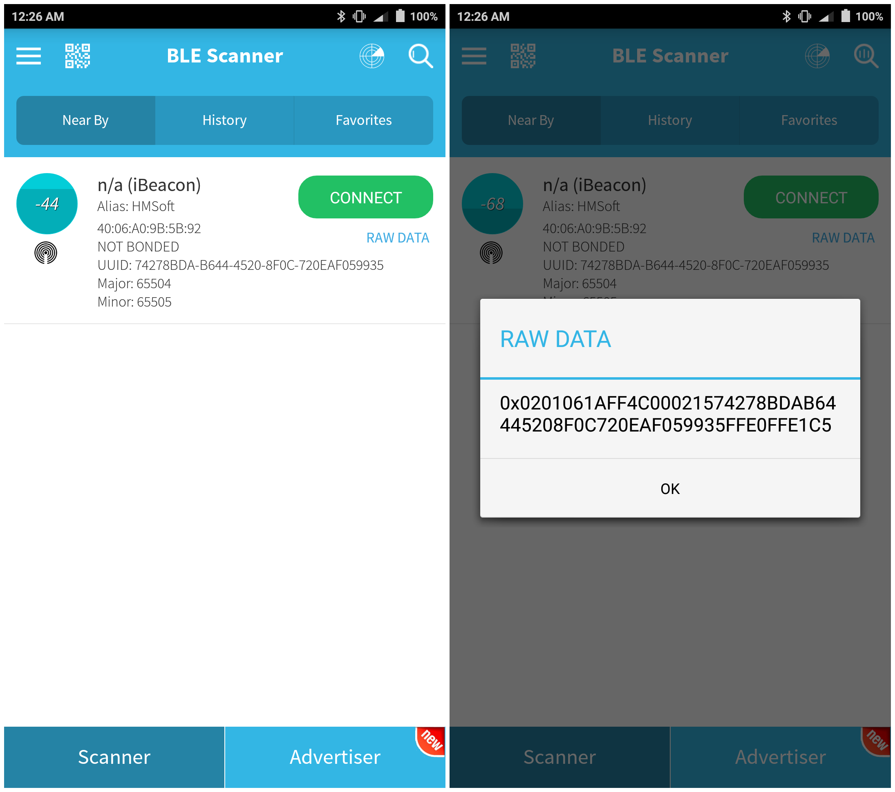
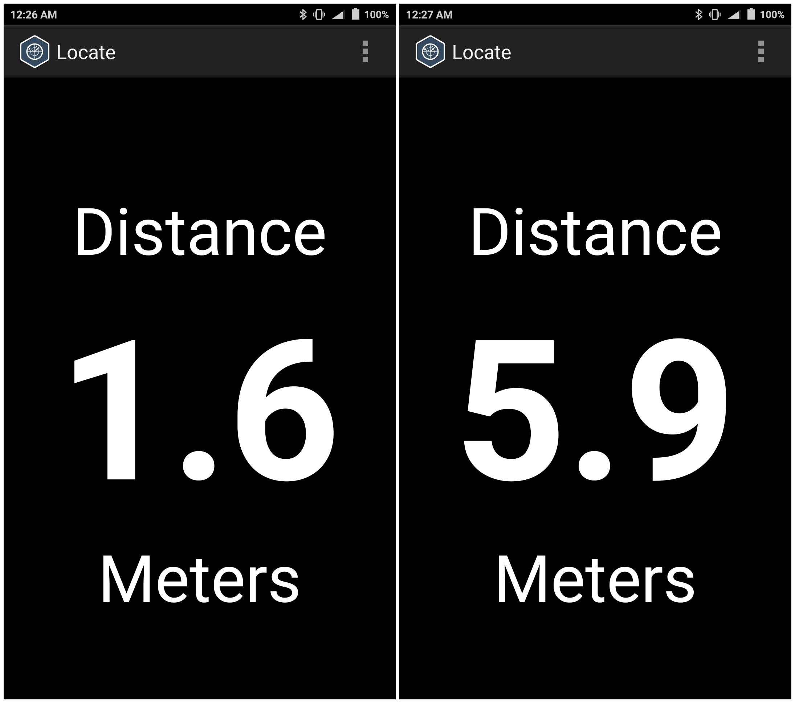
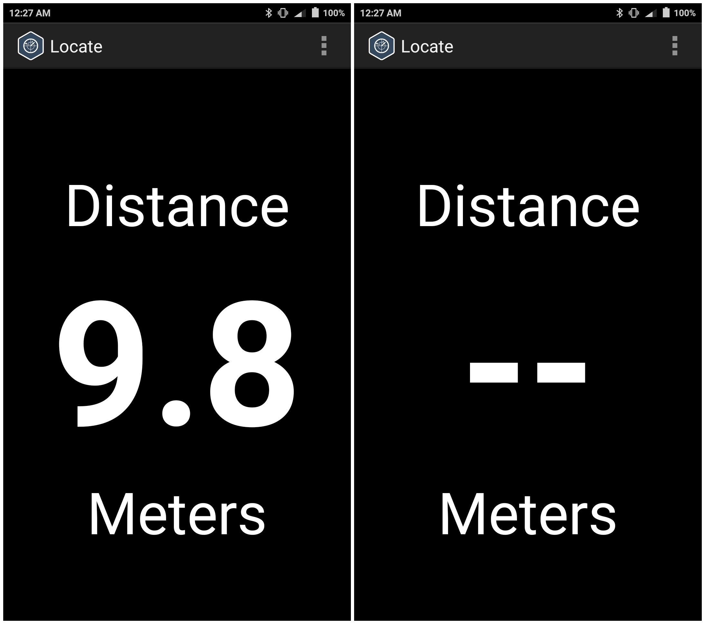
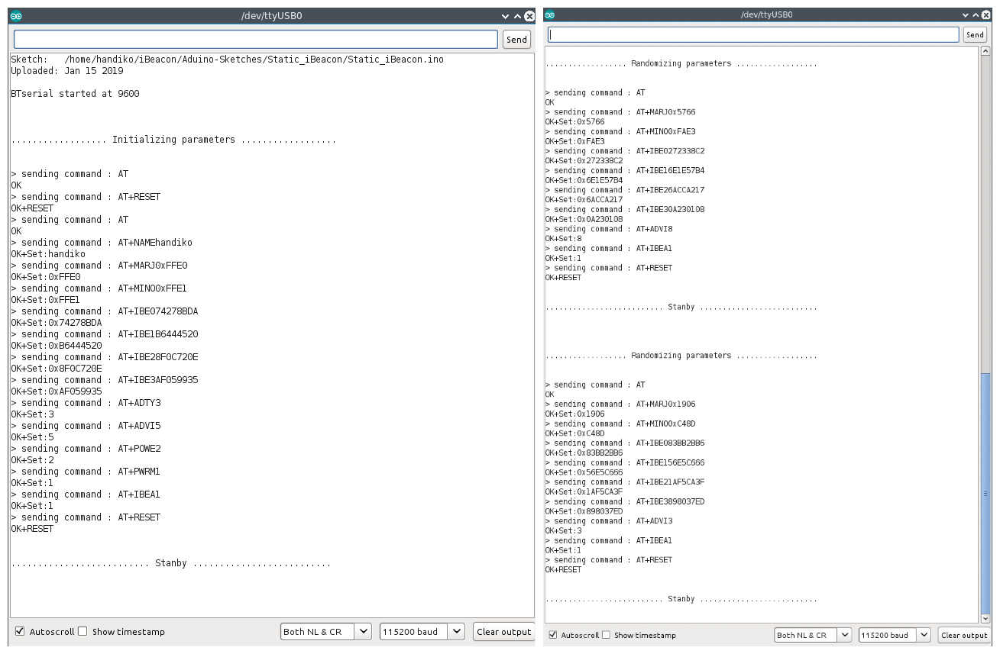
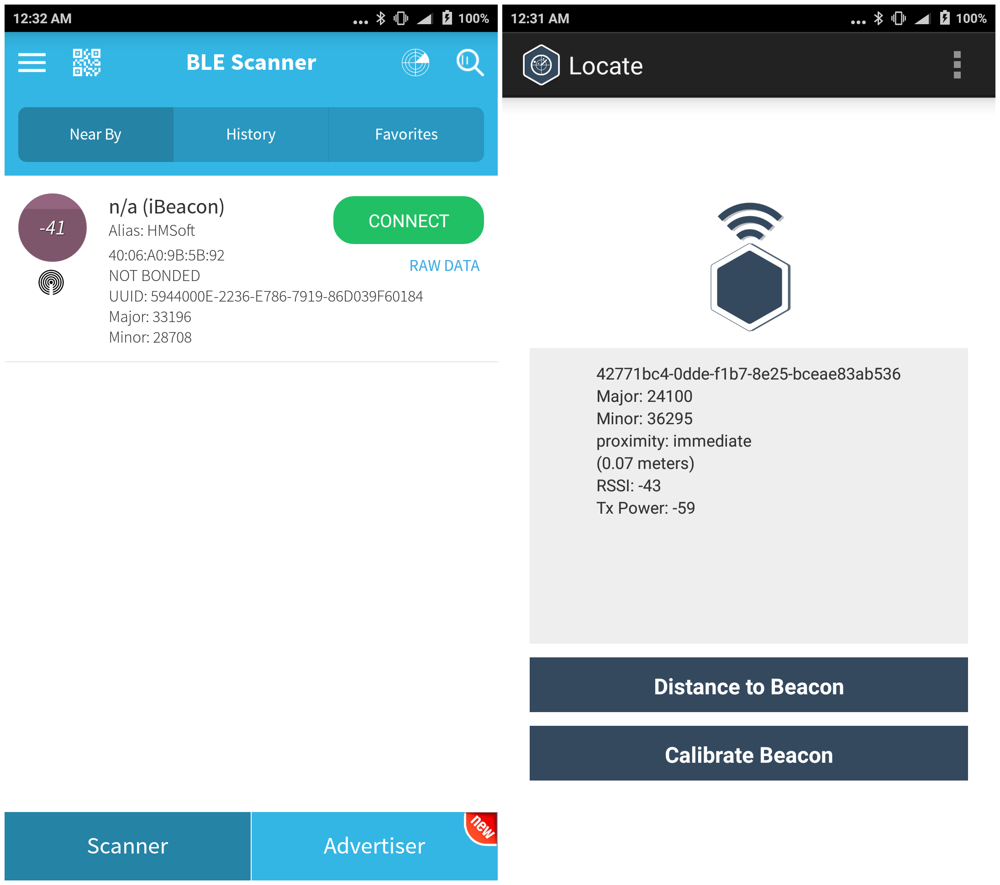

# iBeacon using a JDY-08 BLE module
Create and demonstrate iBeacon using JDY-08 module with HM-10 firmware.
The UUID string, major, and minor numbers are dinamically and periodically changeable during opreation.

The story behind this is all about I want to make an iBeacon without any high cost Arduino shield or dedicated Arduino IDE compatible BLE (Bluetooth Low Energy) platform such as nordicRF RedBear BLEs. When I found some really inexpensive BLE module on some online shops (JDY-08 BLE module), i quickly check the datasheet and bought some. Later I learnt that these modules can be re-flashed using HM-10 BLE firmware and then be transformed into an iBeacon. I already wrote another repo which describes the process to re-flash JDY-08 module with HM-10 firmware, here in my [GitHub page](https://handiko.github.io/JDY-08-Reflash/) or [GitHub repo](https://github.com/handiko/JDY-08-Reflash).

## Requirements
* **JDY-08 BLE module with HM-10 firmware installed** please checkout in my [GitHub page](https://handiko.github.io/JDY-08-Reflash/) or [GitHub repo](https://github.com/handiko/JDY-08-Reflash).
* **Arduino UNO** or any pin compatible board.
* **Android BLE Scanner and / or iBeacon Locator app** on your smartphone.
* **One 1k resistor and One 2k2 resistor**. Values are not extremely critical.
* **Breadboard and some jumper wires**

## Wiring
I included the fritzing wiring file in **iBeacon/Fritzing** folder (optional) if you wanna check it out.

## Demo
### Default UUID string, Major, and Minor numbers
* UUID string : 74278BDA-B644-4520-8F0C-720EAF059935
* MAJOR       : 0xFFE0
* MINOR       : 0XFFE1

### Demo - Configure the JDY-08 into an iBeacon with default values
The Arduino Sketch for this demo included in **iBeacon/Aduino-Sketches/Static_iBeacon**

Then i tried to use the iBeacon locator app to find the furthest distance i can detect it.

As it turns out, it was about 10 meters (indoor).

### Demo - Periodically change the iBeacon parameters (UUID, Major, Minor, and Advertising interval)
The Arduino Sketch for this demo included in **iBeacon/Aduino-Sketches/Dinamic_iBeacon**.
Here you see the serial monitor output when it was a one-time-only configuration (left) and periodic configuration (right)

While it was running, you can comfirm the parameter changes with the BLE scanner or iBeacon locator app

## Acknowledgements
Thank you for:
* [https://www.iot-experiments.com/jdy-08/](https://www.iot-experiments.com/jdy-08/)
* [https://elementztechblog.wordpress.com/2017/03/23/ibeacon-using-hm10-ble-module/](https://elementztechblog.wordpress.com/2017/03/23/ibeacon-using-hm10-ble-module/)
* [https://github.com/RedBearLab/CCLoader](https://github.com/RedBearLab/CCLoader)
* [https://github.com/PaulStoffregen/AltSoftSerial](https://github.com/PaulStoffregen/AltSoftSerial)

## Contributing
1. Fork it [https://github.com/handiko/iBeacon/fork](https://github.com/handiko/iBeacon/fork)
2. Create new branch (`git checkout -b myfeature`)
3. Do some editing / create new feature
4. Commit your works (`git commit -m "Adding some myfeature blah blah.."`)
5. Push to the branch (`git push -u origin myfeature`)
6. Create a new Pull Request
...
